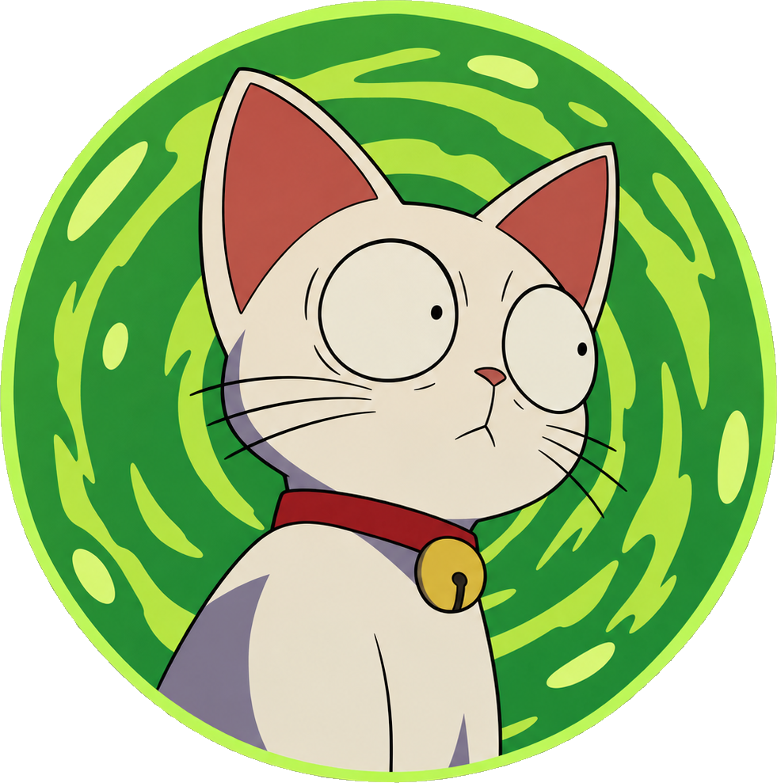

<div align="center">



# 🐱 Mewlang

**Learn programming languages by building things that make each language worth learning.**

</div>

---

Mewlang is a hands-on programming-language learning project built around one idea:

> **Don't just learn a language. Discover what it makes possible.**

Instead of following a collection of syntax tutorials or building the same CRUD application in every language, Mewlang explores different programming languages through projects specifically designed around their unique strengths, philosophies, and programming models.

## 🧠 The idea

Every programming language has something interesting about it.

**Go** makes concurrent systems approachable.

**Ruby** makes metaprogramming and expressive DSLs feel natural.

**Perl** turns text processing into a superpower.

**Erlang** treats massive concurrency and failure as fundamental design problems.

**Racket** makes creating programming languages itself surprisingly accessible.

Mewlang uses projects to make those differences tangible.

---

## 🐾 Projects

### 🐜 Go — Digital Ant Colony

Build a large concurrent simulation where thousands of autonomous ants search for food, communicate, leave pheromone trails, and recover from failures.

**Explore:**

* Goroutines
* Channels
* Concurrency
* Synchronization
* Context cancellation
* Worker pools
* Race detection
* Fault injection
* Distributed systems

> **Question:** What happens when concurrency becomes the natural way to model the world?

---

### 🐱 Ruby — Programmable Automation DSL

Build a Ruby-based automation framework where pipelines can be written almost like a programming language:

```ruby
pipeline "research" do
  fetch "papers"
  filter topic: "AI"
  summarize
  save_to "knowledge_base"
end
```

**Explore:**

* Blocks
* Procs and lambdas
* Objects
* Reflection
* `method_missing`
* Dynamic methods
* Metaprogramming
* DSL design
* Runtime introspection

> **Question:** What if your application could become its own language?

---

### 🕵️ Perl — Text Archaeologist

Build a data-forensics tool capable of digging through messy real-world text and extracting useful structure.

Process:

* Logs
* CSV
* JSON
* XML
* Source code
* Configuration files
* Malformed data
* Arbitrary text

**Explore:**

* Regular expressions
* Text transformation
* File processing
* Streams
* References
* Unix pipelines
* CLI applications
* CPAN
* Parsing
* Data processing

> **Question:** What happens when text manipulation is the core of the language?

---

### 🐉 Erlang — The Internet That Never Dies

Build a simulated distributed network containing thousands of nodes that communicate, crash, restart, disconnect, and recover automatically.

**Explore:**

* Processes
* Message passing
* Pattern matching
* `receive`
* Links
* Monitors
* OTP
* `gen_server`
* Supervision trees
* Distributed systems
* Fault tolerance

Eventually, deliberately destroy parts of the network and watch it recover.

> **Question:** What if failure wasn't an exception, but a normal operating condition?

---

### 🧪 Racket — Language Factory

Build a toolkit for creating small domain-specific programming languages.

Create languages for things such as:

* Finance
* Robots
* Configuration
* Games

**Explore:**

* Functional programming
* Higher-order functions
* Structs
* Macros
* Syntax objects
* Hygienic macros
* Parsers
* ASTs
* Interpreters
* Compilers
* `#lang`
* Language-oriented programming

> **Question:** What if learning a programming language meant learning how to create one?

---

## 🎯 Philosophy

Mewlang follows a few principles.

### 1. Learn by building

Every language is learned through a substantial project.

### 2. Exploit the language

The project should use features that make the language distinctive.

### 3. Understand the "why"

Learning syntax isn't enough.

The goal is to understand:

> **Why would someone choose this language?**

### 4. Compare programming models

The same problem can look completely different depending on the language.

Mewlang makes those differences visible.

### 5. Build real software

Projects should include:

* Tests
* Error handling
* Documentation
* CLI interfaces
* Logging
* Configuration
* Performance considerations
* Debugging
* Realistic architecture

The final result should be something worth putting on GitHub.

---

## 🗺️ Learning Path

```text
                    🐱 MEWLANG
                        │
        ┌───────────────┼───────────────┐
        │               │               │
    Concurrency     Expressiveness    Data
        │               │               │
       Go              Ruby            Perl
        │
        ├───────────────┐
        │               │
   Fault Tolerance   Language Design
        │               │
      Erlang          Racket
```

Each project explores a different way of thinking about software.

---

## 🛠️ What you'll learn

By working through Mewlang, you'll encounter:

* Imperative programming
* Functional programming
* Object-oriented programming
* Metaprogramming
* Domain-specific languages
* Concurrency
* Actor systems
* Distributed systems
* Fault tolerance
* Parsing
* Compilers
* Interpreters
* Type systems
* Unix philosophy
* Testing
* Debugging
* Performance engineering

But more importantly, you'll learn how **programming language design influences software architecture**.

---

## 🚀 Getting started

Choose a language and start with its project.

You don't need to know the language beforehand.

Each project progresses from:

```text
Language basics
      ↓
Tiny exercises
      ↓
Small prototype
      ↓
Project milestone
      ↓
More language features
      ↓
Advanced architecture
      ↓
Final challenge
```

The objective isn't to memorize syntax.

It's to reach the point where you can look at a problem and think:

> **"This language would be interesting for this."**

---

## 🧩 Why "Mewlang"?

Because programming languages are weird creatures.

Some are good at concurrency.

Some manipulate text beautifully.

Some let you reshape the language itself.

Some are built around surviving failure.

Some make types do incredible things.

So Mewlang treats languages like different creatures to explore.

```text
        🐱
       / | \
      /  |  \
    Go Ruby Perl
      \  |  /
       Erlang
          \
         Racket
```

Different languages.

Different powers.

Different ways of thinking.

---

## 📌 Project Status

Mewlang is an educational project and an ongoing exploration of programming languages.

New languages and projects can be added over time.

Potential future explorations:

* **OCaml** — Typed workflow compiler
* **Haskell** — Rule/reasoning engine
* **Clojure** — Immutable time-travel database
* **Zig** — Memory observatory
* **Smalltalk** — Live programmable simulation
* **Crystal** — Ruby-like native systems tools
* **Nim** — Metaprogrammed systems utilities
* **F#** — Functional data-processing platform

---

## ⭐ The goal

Mewlang isn't about finding the **best** programming language.

It's about discovering that there isn't one universal way to think about software.

**Learn the language.**

**Build something weird.**

**Break it.**

**Understand why it works.**

**Then learn another language and see the problem differently.**

<div align="center">

### 🐱 Welcome to Mewlang.

</div>
